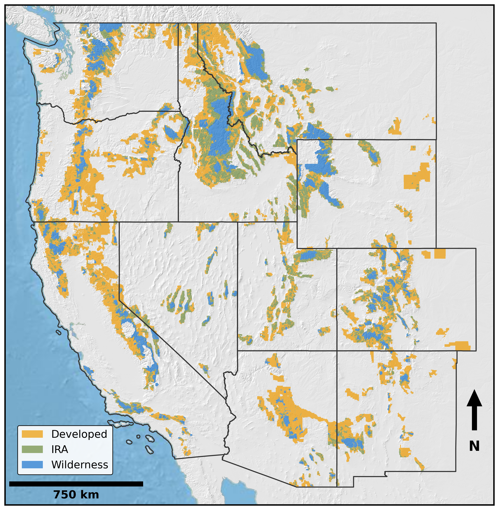

<div align="center">

# Roadless status under The Roadless Area Conservation Rule is not associated with increased wildfire in the US National Forest System

[](https://creativecommons.org/licenses/by/4.0/)
[](https://www.python.org/)
[](https://www.mtbs.gov/)
[](https://doi.org/10.5281/zenodo.17932816)



<sub>A map of National Forest System land designations in the western United States: developed areas, Inventoried Roadless Areas (IRAs), and Congressionally designated wilderness areas.</sub>

</div>

This GitHub repository contains the analysis logic for the manuscript: [*Roadless status under The Roadless Area Conservation Rule is not associated with increased wildfire in the US National Forest System*](https://conbio.onlinelibrary.wiley.com/doi/10.1111/csp2.70411).


## Overview

On Aug. 29, 2025, the US Department of Agriculture announced they intend to rescind the 2001 Roadless Area Conservation Rule [1]. "The Rule" protects inventoried roadless areas across the national forest system [2]. The Notice of Intent to rescind the Rule (90 FR 42179), cites rising rates of wildfire and states that allowing road building on these lands will allow for “swift and immediate action to reduce wildfire risk”.  

Our research group previously published an analysis [3] that addressed the question of whether roadless status is associated with a greater rate of burning or burn severity. The same conclusions were reached independently using similar data by [4] and align with the findings from [5]. To assist informed decision making, we have updated and expanded upon these prior analyses to address recent extreme fire years and explicitly differentiate among three mutually exclusive access categories: Congressionally designated wilderness, Inventoried Roadless Areas (IRAs; excluding wilderness land), and developed areas. 

In our analysis, we do the following:  
1. We compile and summarize four decades (1984–2023) of spatially explicit fire data using the [Monitoring Trends in Burn Severity](https://www.mtbs.gov/) dataset across forested regions of the western US National Forest System.  
2. We compare burn rates across three land management categories: wilderness areas, IRAs, and developed areas.

Our analysis indicates that IRAs across western states NFS land are not associated with a significantly greater rate of burning – or a greater rate of moderate- and high-severity fire – relative to roaded or developed lands.

## Summary of the analysis results

**Fire occurrence between between 1984 and 2023 in the Western US National Forest System:**

|  | Fire of any severity | Moderate- or high-severity |
|---|---|---|
| Roaded and developed | 6,708,169 ha (26.9%) | 3,181,818 ha (12.8%) |
| Inventoried Roadless Areas (IRAs) | 3,370,353 ha (30.1%) | 1,789,970 ha (16.0%) |
| Wilderness | 4,182,081 ha (55.2%) | 1,978,263 ha (26.1%) |

* IRAs burned at approximately the same rate as developed lands (rate ratio=1.13; 95% CI: 0.92–1.36).
* Wilderness lands burned at a substantially higher rate than developed lands (rate ratio RR=2.06; CI: 1.59–2.66) or IRAs (rate ratio RR=1.84; CI: 1.57–2.13).

**Fire occurence between between 2014 and 2023 (the past decade) in the Western US National Forest System**

|  | Fire of any severity | Moderate- or high-severity |
|---|---|---|
| Roaded and developed | 3,625,398 ha (14.5%) | 1,718,779 ha (6.9%) |
| Inventoried Roadless Areas (IRAs) | 1,441,047 ha (12.9%) | 774,042 ha (6.9%) |
| Wilderness | 1,544,219 ha (20.4%) | 720,480 ha (9.5%) |

* IRAs burned at the same or a slightly lower annual rate than developed lands (rate ratio RR=0.89; CI: 0.70–1.17).
* Wilderness lands continued to burn at a higher rate than developed lands (rate ratio RR=1.39; CI: 1.02–2.04) and IRAs (rate ratio RR=1.59; CI: 1.18–1.97).

At the date of submission (January 6th, 2026), the year 2023 was the most recent year of complete MTBS data.

## Data availability

The datasets used in our analysis are available via a [Zenodo repository](https://zenodo.org/uploads/17932816).

## Repository overview

The `./src` folder contains the logic used in the analysis. This is divided into 3 sections:
- **./format_data_layers:** Downloading, processing, and aligning the datasets.
- **./analysis**: Summarizing the MTBS fire data .
- **./visualization**: Logic for generating figures that appeared within the paper.

## Publication citation

```bibtex
@article{kilbride2026roadless,
  title   = {Roadless status under The Roadless Area Conservation Rule is not
             associated with increased wildfire in the US National Forest System},
  author  = {Kilbride, John B. and Johnston, James D. and Kennedy, Robert E.
             and Meigs, Garrett W. and Francis, Enoh Martha},
  year    = {2026},
  journal = {Conservation Science and Practice}
}
```


## References

[1] 66 FR 3244 (2001) Special Areas; Roadless Area Conservation. https://www.govinfo.gov/app/details/FR-2001-01-12/01-726 

[2] 90 FR 42179 (2025) Special Areas; Roadless Area Conservation; National Forest System Lands  https://www.federalregister.gov/documents/2025/08/29/2025-16581/special-areas-roadless-area-conservation-national-forest-system-lands 

[3] Johnston, J. D., Kilbride, J. B., Meigs, G. W., Dunn, C. J., & Kennedy, R. E. (2021). Does conserving roadless wildland increase wildfire activity in western US national forests? *Environmental Research Letters*, *16*(8), 084040.  

[4] Healey, S. P. (2020). Long-term forest health implications of roadlessness. Environmental Research Letters, 15(10), 104023.

[5] Bradley, C. M., Hanson, C. T., & DellaSala, D. A. (2016). Does increased forest protection correspond to higher fire severity in frequent‐fire forests of the western United States?. Ecosphere, 7(10), e01492.
